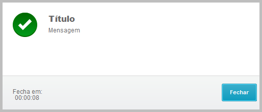
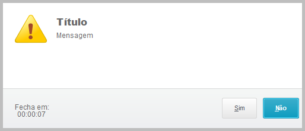
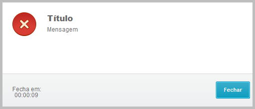
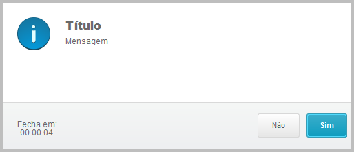

# advpl-MsgTimer
Função AdvPL de mensagens (Alert, Info, Stop, Success, YesNo e NoYes) com Timer para fechamento automático

### Exemplo de utilização:

~~~xBase
U_MsgTimer(10, "Mensagem", "Título", MT_ISUCCES, MT_TDEFAULT)
~~~

## Finalidade
Apresentar uma mensagem no formato padrão do Protheus 12, permitindo o fechamento automático caso o usuário não interaja com a mensagem, evitando sessões abertas por muito tempo desnecessariamente. 

## Implementação
Compilar o fonte `MsgTimer.prw` no seu RPO e chamar via chamada de função de usuário `U_MsgTimer()`.

> Caso deseje, o arquivo pode ser renomeado para `.tlpp`, o funcionamento será o mesmo porém no formato TL++.

## Futuras implementações
- [ ] [Implementar Conout quando IsBlind](https://github.com/AlencarGabriel/advpl-MsgTimer/issues/1)

## [Reportar problemas ou sugerir melhorias](https://github.com/AlencarGabriel/advpl-MsgTimer/issues)

## Colaborar
Assim como meu objetivo é ajudar aqueles que precisam, caso você faça uma melhoria ou encontre algum problema no projeto, fique a vontade para ajustar e me mandar seu [Pull Request](https://github.com/AlencarGabriel/advpl-MsgTimer/pulls), estarei avaliando e com certeza sendo útil estará disponível e farei uma agradecimento.

---

# Documentação

### Lista de Parâmetros:
  
Ordem | Parâmetro | Tipo        | Opcional?  | Default     | Descrição
:----:|-----------|-------------|:----------:|:-----------:|-------------------------------
1     | nSeconds  | Numeric     | Sim        | 0           | Tempo em segundos que a mensagem será exibida antes de ser fechada
2     | cMensagem | Characters  | Sim        | " "         | Descrição da mensagem [TEXT or HTML Formats]
3     | cTitulo   | Characters  | Sim        | " "         | Título da mensagem [TEXT or HTML Formats]
4     | cIcone    | Characters  | Sim        | MT_IINFO    | Ícone formato **MT_I** [ICON OF MESSAGE] ou RESOURCE compilados
5     | nTipo     | Numeric     | Sim        | MT_TDEFAULT | Tipo **(botões)** da mensagem formato **MT_T** [TYPE OF MESSAGE]

> **Importante!**
> - Uso de HTML no Título e/ou Mensagem pode ocasionar problemas de dimensionamento nas mensagens;
> - O parâmetro `cIcone` pode receber qualquer *resource* compilado no RPO;
> - É possível combinar qualquer ícone com qualquer tipo de mensagem;
> - O parâmetro `nSeconds` quando 0 (zero) não apresentará o contador de tempo, nem fechará a mensagem automaticamente;
> - Cuidado ao utilizar mensagem com Timer e tipo `NoYes` ou `YesNo`, pois o retorno default caso o tempo exceda será o botão focado: **No** ou **Yes**. 

### Definições:

Definição   | Descrição                                            | Retorno Default
------------|------------------------------------------------------|---------------------
MT_TDEFAULT | Adiciona somente o botão default "Fechar"            | Nil
MT_TYESNO   | Adiciona os botões "Sim" e "Não", focando no "Sim"   | .T.
MT_TNOYES   | Adiciona os botões "Não" e "Sim", focando no "Não"   | .F.
MT_ISUCCES  | Ícone Default Sucesso                                | Ícone não influencia no retorno
MT_IALERT   | Ícone Default Alerta                                 | Ícone não influencia no retorno
MT_IERROR   | Ícone Default Erro                                   | Ícone não influencia no retorno
MT_IINFO    | Ícone Default Informação                             | Ícone não influencia no retorno

## Exemplos de utilização:

Exemplo | Code
--------|-------------
          | U_MsgTimer(10, "Mensagem", "Título", MT_IALERT, MT_TNOYES)
      | U_MsgTimer(10, "Mensagem", "Título", MT_IERROR, MT_TDEFAULT)
            | U_MsgTimer(10, "Mensagem", "Título", MT_IINFO, MT_TYESNO)
  | U_MsgTimer(10, "Mensagem", "Título", MT_ISUCCES, MT_TDEFAULT)

## Compatibilidade Homologada

- [x] Protheus 12 - Release 17
- [x] Protheus 12 - Release 23
- [x] Protheus 12 - Release 25
